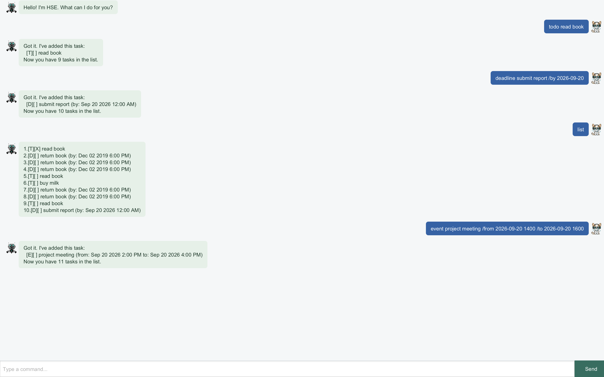

# HSE User Guide

HSE is a task manager for keeping track of todos, deadlines, and events through a conversational
interface.



## Quick Start

1. Open a terminal in the project folder.
2. Run `./gradlew run`.
3. Enter a command in the input field and press Enter or Send.
4. Enter `bye` when you are finished.

Commands are case-sensitive. Extra spaces around a command are ignored, and task numbers begin at 1.

## Graphical Interface

The JavaFX interface distinguishes user messages, HSE replies, and error messages with separate visual styles.
The conversation area and command input resize with the application window.

## Features

### Adding Tasks

Add a todo without a date:

```text
todo read book
```

Add a deadline with `/by`:

```text
deadline submit report /by 2026-09-20 2359
```

Add an event with both `/from` and `/to`:

```text
event project meeting /from 2026-09-15 1400 /to 2026-09-15 1500
```

Dates can use `yyyy-MM-dd`, `d/M/yyyy`, or `d-M-yyyy`. Times use 24-hour `HHmm` format and are optional.

### Viewing and Finding Tasks

```text
list
find book
finddate 2026-09-15
```

`find` looks for a keyword in task descriptions. `finddate` lists deadlines and events occurring on a date.

### Updating Tasks

```text
mark 1
unmark 1
delete 1
```

Use the task number shown by `list`. `mark` completes a task, `unmark` reopens it, and `delete` removes it.

### Sorting Tasks

```text
sort
```

`sort` orders deadlines by due date and events by start date. Todos remain after dated tasks; tasks with the
same date keep their existing order. The new order is saved automatically.

### Exiting HSE

```text
bye
```

## Saving and Errors

HSE saves task changes automatically. If a command is incomplete, a task number is invalid, a date does not
exist, or saving fails, HSE displays an error message and remains open so you can correct the command.
